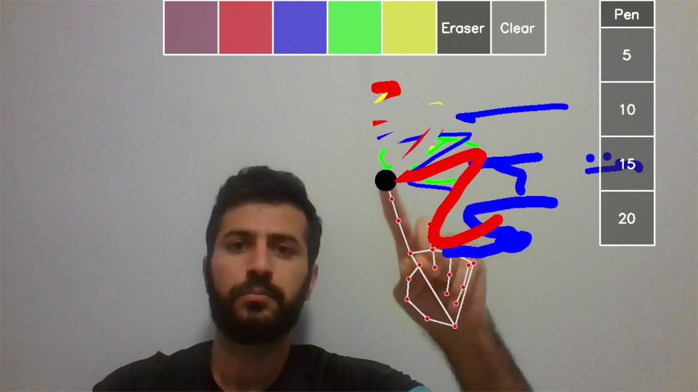

# virtual painter
This project is about using openCV and mediapipe libraries   to utilize the webcamera for drawing in real time.   
The main idea is:   
* detect hands using mediapipe
* detect wheither the index and middle fingers are up
* detect fingers' tip location
* draw a line when only the index finger is up and make a sellection when both index and middle fingers are up
* draw on a black canvas then mask it with actual frame   
to watch the demo of the program press [here](https://youtu.be/ZNPu2nwcXX4)


# Installation
There are some prerequisites that are needed to be done to be able to run this project.
It's needed to install the required libraries by running the following commend in the project's directory:
```bash
pip install -r requirements
```
now you can run the project directly from your terminal:
```bash
python main.py
```
If everything has gone right, a window will  pop up as in the below figure:
[](https://youtu.be/unW7xfYYom4 "virtual painter demo (python, openCV and mediapipe)
") 
